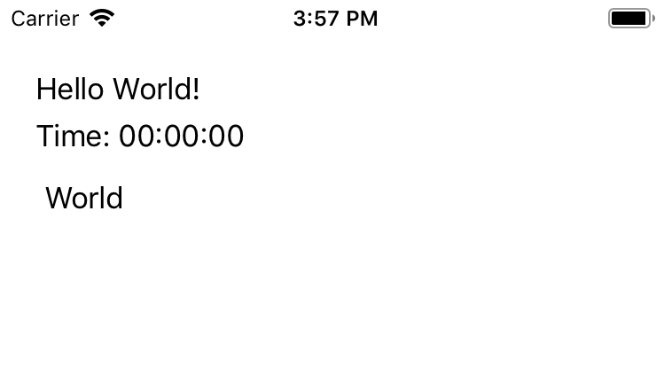

# Appsolutely Fabulous

Functional mobile client development with F# and Xamarin Forms

James Murphy - @recumbent

---

@snap[west span-40]
### James Murphy - Software Engineer
@snapend

@snap[east span-40]

@snapend

---

# Fabulous?

Note:

Why do we need something new?

There is a really good story for cross platform application mobile development using .NET with Xamarin, and for all platforms wth Xamarin forms, but whilst you can - and people do - use F# the core tends to be  MVVM, which is a pattern I like and one that that works really well... but its also _very_ object oriented. And to build an app you will have a view, in XAML, and code behind, and a you'll wire that to a view model... there may be a better way

---

#### So where does Fabulous come from?

Don Syme + Xamarin

Note:

I'm not quite sure what drove the decision or what the exact process was, but someone decided there ought to be a functional first approach to writing mobile client application - and if you're Microsoft you address this problem by sending Done Syme - creator of F# to Xamarin in the hope that something interesting will happen.

In this case they went looking for prior art and that led them to...

---

@snap[north]
## Fable Elmish
@snapend

@snap[south-west span-40 fragment]

@snapend

@snap[south-east span-40 fragment]

@snapend

Note:

Fable - which is an F# to javascript transpiler and Elmish which is an F# framework for fable that resembles elm
So what it elm?

---

@snap[west span-40]
# Elm

@snapend

@snap[east span-40 fragment]
A delightful language for reliable webapps.
https://elm-lang.org/
@snapend

Note:

Well... elm describes itself as "A delightful language for reliable webapps" - that's a bold claim, but there are good reasons why one might find it delightful and there's a strong argument that functional programming lends itself to reliable applications

---

### So what is Elm? 

@ul

- Functional language with an ML syntax
  - Statically typed
  - All functions are pure
     - Always returns the same result for a given input
     - _*No side effects*_
- DSL for creating markup
- Framework for web applications

@ulend

Note:

So what is elm?
Well firstly its a functional language with an ML syntax - so in that respect very similar to F#
Its statically typed, so the compiler is your friend
Everything is a function - and all functions are pure  that means that for any given input we will always get the same output and also that there are _no side effects_ - which makes things interesting and we'll come back to that in a moment

There is a DSL for creating html

And there is a framework that makes it possible to run an application, and this is the core reason for things being elmish

---

@snap[west span-50]
### The Elm Architecture
@snapend

@snap[east span-30]
@box[bg-black text-white rounded fragment text-15 box-padding](Model)
@box[bg-black text-white rounded fragment text-15 box-padding](View)
@box[bg-black text-white rounded fragment text-15 box-padding](Update)
@snapend

Note:
As I said, that you can only write pure functions is interesting, user input is not deterministic and rendering a UI to the screen is a side effect - and this is where the framework, more specifically The Elm Architecture comes in.

The Elm Architecture is the Model, View, Update pattern - that was the inspiration for redux amongst other things - and its a framework this pattern that enables your pure functions to create a proper user interace.

So what is the model view architecture?

---

# Model

```F#
{  
     Id : ItemId  
     Name : string  
     Required : bool  
     Purchased : bool  
     Aisle : Aisle Option  
}  
```

Note:
We start with a Model that defines the current state of your app, it could be all your data for a small app

---

# View

```F#
    let view (model: Model) dispatch =
```

Note:

The view is a pure function that takes your model and returns the view, in the case of Elm that would be http, but for fabulous its Xamarin Forms. The view gets passed to the runtime framework which does a diff and renders the ui to the screen

---

# Update

```F#
    let update msg model =
```

Note:

Your users interaction with the view will generate a message - from a list you define - and that will get passed with the model to the update function, Update is a pure function that will return a new model

---

# Model

Note:

The new model will be passed to the view function and round we go again. Some of you may have noticed that this limits you to whatever you have in your model (which makes it ephemeral...) and you'd be right, so there's more cheating to get round that and I'll come back to that later.

---

@snap[west span-40]
### A minimal application
@snapend

@snap[east span-40]

@snapend

Note:
So lets take a look at a minimal application - how about a minimal hello world? Per this classy mockup?

The value we type in the box will appear in the greeting

---?code=Examples/HelloWorld-01.fs&lang=fsharp&color=#1E1F21&title=Hello World App

@[9-10](Model)
@[24-39](View - Content Page)
@[29-39](View - Children)
@[12-13](Message)
@[19-22](Update)
@[41-42](Program)
@[14-17](Init)
@[44-52](App)

---

# Live Demo 01

---

@snap[west span-40]
### New feature
@snapend

@snap[east span-40]

@snapend

---?code=Examples/HelloWorld-02.fs&lang=fsharp&color=#1E1F21&title=Hello World App with Subscription

@[12](Add time to Model)
@[21](Initialise time)
@[33-34](Format time)
@[45-46](Add time to View)

---

@snap[central]

@snapend

---?code=Examples/HelloWorld-02.fs&lang=fsharp&color=#1E1F21&title=Hello World App with Subscription

@[17](Time Changed)
@[30-31](Update with changed time)
@[56-60](Timer function)
@[73](Add subscription)

---

# Live Demo 02

---

# A _slightly_ more complex App

Note:

A single page is seldom enough, nor do apps live in isolation. We need to be able to launch long running code, to make external requests, etc

So lets add a page with a random quote on it

---?code=Examples/HelloWorld-03.fs&lang=fsharp&color=#1E1F21

@[11-13](Page Type)
@[15-19](Request State)
@[21-26](Model with Page and Quote)
@[35-40](Initialise new properties)
@[105-108](View Button on Main Page)
@[31](Page changed message)
@[62-69](Handle page changed)
@[64-66](Main page)
@[67-69](Quote page - command)
@[49-54](getQuote command)
@[44-47](Platform detection)
@[53](QuoteReceived message)
@[70-71](Handle QuoteReceived)
@[109-137](Quote Page)
@[78-83](Quote Text)

---

Live demo 03

---

# Fabinals - an example with more depth

Note:

Clearly these are very simple examples to just begin to touch on how all of this gets wired together, they're not pretty and they don't show any depth.

There's a new feature of Xamrin.Forms called "Shell" - which provides a shell appication and for that they have a sample app call Xaminals, this has been ported fairly directly to Fabulous as Fabinals...

Lets take a look at the app and a bit of the code

---

Live demo 04 - Fabinals

---

@snap[west]
# So...
@snapend

@snap[east]

@ul

### The Good

- Nice models via F# types
- Compose complex views
- Event driven
  - All Events Known
- Functional all the way down

@ulend

@snapend

---

@snap[west]
# But...
@snapend

@snap[east]

@ul

### The less good

- Work in progress
  - Not everything is supported
- Still have to learn Xamarin.Forms
- Probably other things...

@ulend

@snapend

---

@snap[west]
# And...
@snapend

@snap[east]

@ul

### I didn't cover

- Live updates
- More complex navigation
- Styling (in detail)
  - But it _is_ Forms
- Probably other things...

@ulend

@snapend

---

### To Start

@ul

- https://fsprojects.github.io/Fabulous/
- `dotnet new -i Fabulous.Templates`
- `dotnet new fabulous-app -n MyFabulousApp`
- `--WPF --UWP --macOS --GTK`
- Fame, fortune, Hainton meetups...

@ulend

---

# THANK YOU!

- https://twitter.com/recumbent 
- https://github.com/recumbent
